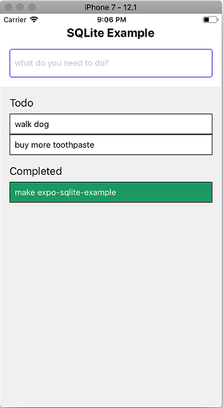

# simple-expo-sqlite-todo

> simple React Native TODO app using `expo-sqlite`

### The app allows adding todo items, marking them as done, and deleting done items. `SQLite` features used include creating and opening databases, creating tables, inserting items, querying and displaying results, using prepared statements.



## How to start

```bash
$ npm install
$ npm start
```

&copy; 2024 @codeguru827

All rights reserved.
